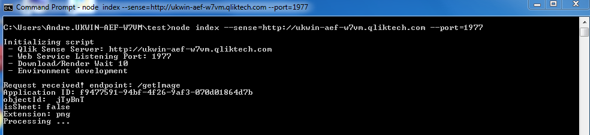

# Qlik Sense Custom Visualization Printing Web Service

> Currently Qlik Sense does not provide a way for custom extensions to export images. This web service is a work around based on Qlik Sense /single, nodeJS and PhathomJS.

[](resources/screenshots/v01.png)

The webservice takes command line arguments allowing the user to specify the port to listen to, the location of Qlik Sense server and how long to wait for phatomJS to donwload and render files.


## Dependencies

You will need to have git and Node installed and then run:
```
> cd grunt
grunt> npm install
grunt> grunt build
```
which will install the remaining dependencies and build the web service 


## How to use the web service

Open a terminal and navigate to the *dist* folder, once there run the following command: 
``` 
> node index.js
```
If you need to customize:
``` 
> node index.js --server=http://example.com/virtualProxy --port=1977 --wait=30
```

*Developer note*: The default values can also be modified in the internal configuration object if desired


## Contacts

You can reach me by email at: [andre.ferreira@qlik.com](mailto:andre.ferreira@qlik.com)

